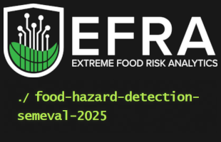

# SemEval 2025 Task 9: The Food Hazard Detection Challenge

## Overview
This repository contains our implementation for **SemEval 2025 Task 9: The Food Hazard Detection Challenge**. The challenge focuses on **explainable classification systems** for food-incident report titles collected from the web. The goal is to develop automated systems that identify and extract food-related hazards with high transparency and explainability.

## Our System

Our system focuses on **Subtask 1 (ST1)**: Text classification for food hazard prediction.

### Datasets Used
We utilize three distinct datasets in our approach:
1. **Original Dataset**: The unmodified baseline dataset
2. **Aug1 Dataset**: Targeted augmentation with 100 additional samples for:
   - 9 lowest-represented product categories
   - 4 lowest-represented hazard categories
3. **Aug2 Dataset**: Comprehensive augmentation achieving near-balanced class distributions

### Approach
1. **Strategic Data Augmentation**:
   - **Aug1**: Focused on addressing severe class imbalances
   - **Aug2**: Comprehensive balancing across all classes

2. **Robust Model Ensemble**:
   The ensemble consists of 13 specialized models:
   - 6 models for `hazard-category` classification
   - 5 models for `product-category` classification
   - 1 multitask model handling both classifications
   
   All models are based on two primary architectures:
   - **`deberta-v3-large`**
   - **`roberta-large`**
   
   Model variations are created through different token chunking strategies during preprocessing.

### Results
Our system achieved:
- **#1 Position** on the Final Leaderboard
- Top performance during the Conception Phase
These results validate our ensemble approach and preprocessing strategies.

### Requirements:
- Python == 3.10


### Setup:
1. Clone the repository:
   ```bash
   git clone https://github.com/Zhennor/Semeval-Task9-The-Food-Hazard-Detection-Challenge-2025
   cd Semeval-Task9-The-Food-Hazard-Detection-Challenge-2025
   ```
2. Install necessary libraries:
   ```bash
   pip install -r requirements.txt
   ```

3. Train model:
   # Model Training Documentation

   ## Training Options

   ### 3.1. Multitask Training 

   This approach trains both hazard-category and product-category models simultaneously, which can lead to better performance through shared learning.

   ```bash
   python3 train_multitask.py \
   --input_file /path/to/your/train_chunk.json \
   --output_dir ./results \
   --model_output_dir ./result \
   --learning_rate 2e-5 \
   --num_epochs 10 \
   --train_batch_size 4 \
   --eval_batch_size 2 \
   --gradient_accumulation_steps 4 \
   --oversample_count 50 \
   --undersample_count 500 \
   --seed 42
   ```

   #### Parameters:
   - `input_file`: Path to training data JSON file
   - `output_dir`: Directory for saving training results
   - `model_output_dir`: Directory for saving model checkpoints
   - `learning_rate`: Learning rate for training (default: 2e-5)
   - `num_epochs`: Number of training epochs (default: 10)
   - `train_batch_size`: Batch size for training (default: 4)
   - `eval_batch_size`: Batch size for evaluation (default: 2)
   - `gradient_accumulation_steps`: Number of steps to accumulate gradients (default: 4)
   - `oversample_count`: Count for oversampling minority classes (default: 50)
   - `undersample_count`: Count for undersampling majority classes (default: 500)
   - `seed`: Random seed for reproducibility (default: 42)

   ### 3.2. Independent Training

   Use this approach when you want to train hazard-category and product-category models separately.

   ```bash
   python3 train_independent.py \
      --data_path /path/to/data.json \
      --model_path microsoft/deberta-v3-large \
      --task [hazard/product] \
      --max_length 512 \
      --output_dir output_classification \
      --batch_size 1 \
      --learning_rate 1e-5 \
      --num_epochs 15
   ```

   #### Parameters:
   - `data_path`: Path to training data JSON file
   - `model_path`: Path to pretrained model (default: microsoft/deberta-v3-large)
   - `task`: Options: 'hazard' or 'product'. Specifies whether to train hazard-category or product-category classifier
   - `max_length`: Maximum sequence length (default: 1280)
   - `output_dir`: Directory for saving outputs
   - `batch_size`: Batch size for training and evaluation (default: 1)
   - `learning_rate`: Learning rate for training (default: 1e-5)
   - `num_epochs`: Number of training epochs (default: 15)

4. Predict:

   ### 4.1. Multitask Prediction
   
   Use this approach when you have a single model trained for both tasks:

   ```bash
   python3 predict_multitask.py \
      --model_name "microsoft/deberta-v3-large" \
      --input_json "path/to/data" \
      --output_dir "output" \
      --batch_size 8 \
      --label_mapping "data/label_mappings.json" \
      
   ```

   #### Parameters:
   - `model_name`: HuggingFace model name or path (default: Quintu/deberta-v3-large-multitask-food)
   - `input_json`: Path to test data JSON file
   - `output_dir`: Directory to save predictions
   - `batch_size`: Batch size for inference (default: 8)
   - `label_mapping`: Path to label mapping file (default: data/label_mappings.json)
   
   ### 4.2. Independent Prediction
   
   Use this approach when you have separate models for hazard and product classification:

   ```bash
   python3 predict_independent.py \
      --hazard_model "huggingface_hazard_model_path" \
      --product_model "huggingface_product_model_path" \
      --input_json "data/private_test_512.json" \
      --output_csv "submission.csv" \
      --output_zip "submission.zip" \
      --output_hazard_json "hazard_predictions.json" \
      --output_product_json "product_predictions.json"
   ```

   #### Parameters:
   - `hazard_models`: Space-separated list of hazard model paths
   - `product_models`: Space-separated list of product model paths
   - `input_json`: Path to test data JSON file
   - `output_csv`: Path to the output CSV file
   - `output_zip`: Path to the output ZIP file
   - `output_hazard_json`: Path to the output hazard predictions JSON
   - `output_product_json`: Path to the output product predictions JSON

### List of Models

#### Multitask Models:
- [Quintu/deberta-multitask-v0](https://huggingface.co/Quintu/deberta-multitask-v0): Combined model for both hazard and product classification

#### Hazard-Category Models:
- [Quintu/deberta-512-hazard-v1](https://huggingface.co/Quintu/deberta-512-hazard-v1)
- [Quintu/deberta-768-hazard-v1](https://huggingface.co/Quintu/deberta-768-hazard-v1)
- [Quintu/deberta-1280-hazard-v1](https://huggingface.co/Quintu/deberta-1280-hazard-v1)
- [Quintu/roberta-512-hazard-v1](https://huggingface.co/Quintu/roberta-512-hazard-v1)
- [Quintu/deberta-512-hazard-v2](https://huggingface.co/Quintu/deberta-512-hazard-v2)

#### Product-Category Models:
- [Quintu/deberta-512-product-v1](https://huggingface.co/Quintu/deberta-512-product-v1)
- [Quintu/deberta-768-product-v1](https://huggingface.co/Quintu/deberta-768-product-v1)
- [Quintu/roberta-512-product-v1](https://huggingface.co/Quintu/roberta-512-product-v1)
- [Quintu/deberta-512-product-v2](https://huggingface.co/Quintu/deberta-512-product-v2)


